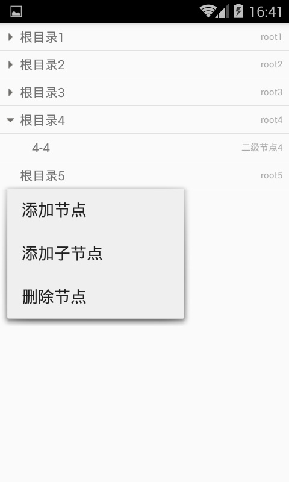

# AndroidTreeView

## 项目介绍
这是一个自定义的无限层级的树形控件，采用自定义ListView和BaseAdapter来实现。 
它可以适配任何Bean List对象，因为内部会将其转化为准备的Node节点List，而Node中的节点id与父节点id是通过注解的方式来解析的，只需要按规则来进行注解对应的Bean类的相应字段即可。 
可以通过长按节点来进行节点的增加和删除。。。

### 效果图如下

